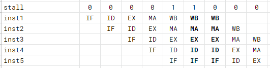

# Stall, forwardingについての補足資料
シミュレータ作成に必要そうなstall, forwardingについての情報を中心にまとめました。

## Stallの種類
このコアで起こりうるストールには以下の種類がある。
- hazard_stall      : 命令間依存によるハザード時
- input_stall       : 入力データの受け取り待ち
- memory_stall      : メモリアクセス待ち
- fpu_stall         : FPU実行待ち

この4つの変数のうちどれか1つ以上がtrueの場合ストールを起こす。

### Hazard stall
後続命令が先行命令にデータ依存している場合に起きる。詳細は「命令間依存の対処」の項を参照。

### Input stall
コアでin命令が実行されたとき、入力バッファが空なら、次の入力データを受け取るまでストールする。この辺の細かい仕様は[io.md](io.md)を参照。

### Memory stall
DDRメモリへのアクセスには複数クロックかかるので、完了するまでの間はストールをする。メモリから出力される`ready`が1になるまでの間ストールを行う。ストールするサイクル数は、

- キャッシュヒットした場合: 1
- キャッシュミスした場合: 100程度？

である。

### FPU stall
fadd, fsubなどの命令は複数クロックかかるため、この間はコアをストールしている。ストールするクロック数は[FPUの説明ファイル](fpu/README.md)に書かれているサイクル数-1としている。

## 命令間依存の対処(forwarding, hazard stall)
命令間にデータ依存がある場合(i.e. 先行命令のdestinationと後続命令のsourceが一致する場合)、可能な限りforwardingで対応し、対処しきれない場合のみストールをする。

### 例1.

### 例2.

lw命令直後にデータ依存のある命令がくる場合、forwardingでは対処できないので1サイクルストールする。また、レジスタへのwrite backはWBステージの**末尾**で行っているので、WB -> EXのフォワーディングも行う必要がある(ここは後で改定するかもしれない)。

## Stall時の動作について
基本的にはstall時には、関係のないステージも含めてすべてのステージの実行を中断する。たとえば2サイクルストールが起きたときの動作は以下のようになる。

ただしhazard stallの場合は、先述の例2のようにEXステージ以降の命令は進める (そうしないとハザードが解消されず永久にストールしてしまう)。